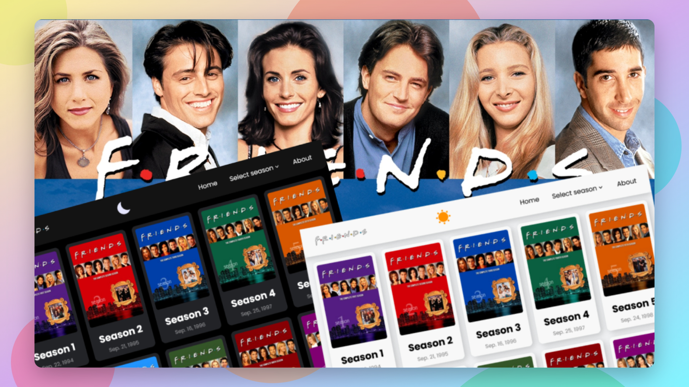

# Friends TV Series Website

<h2 align="center">

[🚀Live Website](https://friends-tv-series-codepapa360.netlify.app)

</h2>

<!-- Badges -->

<!-- Liceensee -->

<!-- Screenshot -->

Welcome to the Friends TV Series website! This project emerged from a simple desire: to create an ad-free platform for enjoying every episode of the iconic show "Friends." Fed up with ads and pop-ups on other streaming sites, I crafted a clean, user-friendly space for fellow fans to enjoy the series uninterrupted.

## Table of Contents

- [Project Overview](#project-overview)
- [Features](#features)
  - [Dynamic Content Loading](#dynamic-content-loading)
  - [Custom Routing Mechanism](#custom-routing-mechanism)
  - [Dark Mode](#dark-mode)
- [Technical Details](#technical-details)
  - [Implementation Challenges](#implementation-challenges)
  - [No Frameworks or Libraries](#no-frameworks-or-libraries)
- [How It Started](#how-it-started)
- [Contributing](#contributing)
- [Contact](#contact)

## Project Overview

This project is a single-page website that provides a user-friendly and ad-free platform to watch episodes of the "Friends" TV series. The idea behind this project was born out of frustration with other streaming sites that bombard users with ads and pop-ups, disrupting the viewing experience. The website aims to provide a clean and enjoyable way to watch the series, while also serving as a practical way to enhance JavaScript skills.

## Features

### Dynamic Content Loading

The website features dynamic content loading, allowing users to navigate through different seasons and episodes seamlessly. Each episode is presented as a card with a thumbnail, title, and release date. Clicking on an episode card updates the content on the page without requiring a full page reload.

### Dark Mode

Dark mode enhances the user experience by providing an alternative color scheme that is easier on the eyes, especially in low-light conditions. Users can toggle between light and dark mode, and their preference is remembered using local storage.

### Custom Routing Mechanism

One of the significant challenges in building this website was implementing a custom routing mechanism for a single-page application without using any frameworks or libraries. The routing system allows users to navigate between different sections of the website while maintaining a smooth and fluid user experience.

## Technical Details

### Implementation Challenges

One of the most challenging aspects of this project was developing a custom routing mechanism. Without utilizing frameworks or libraries, I needed to meticulously handle the application's state, ensuring accurate content display as users moved across sections. I utilized JSON files to manage season and episode data. Additionally, a separate JSON file stored the video URLs, allowing flexibility for future updates. These URLs were collected from sflix.com in the m3u8 format. I sourced the video URLs from platforms like sflix.com, where the videos are available in the m3u8 format.

### No Frameworks or Libraries

To further enhance my JavaScript skills, I chose to build the entire website without relying on any frameworks or libraries. This decision allowed me to gain a deep understanding of how various components work together, from event handling to dynamic content loading.

## How It Started

This project began when I started watching episodes of the "Friends" TV series online and became frustrated with the abundance of ads and pop-ups on various streaming platforms. Inspired by the desire to create a better viewing experience and hone my web development skills, I embarked on building this website from scratch.

## Contributing

This project was primarily developed as a personal learning experience. However, if you'd like to contribute, feel free to fork the repository, make improvements, and submit a pull request.

## Contact

Feel free to contact me with any questions or feedback!

<b>👤 Alamin</b>

- Twitter - [@CodePapa360](https://www.twitter.com/CodePapa360)
- LinkedIn - [@CodePapa360](https://www.linkedin.com/in/codepapa360)
- Frontend Mentor - [@CodePapa360](https://www.frontendmentor.io/profile/CodePapa360)
- Github: [@CodePapa360](https://github.com/codepapa360)

## License

This project is licensed under the [MIT](https://github.com/CodePapa360/Friends-TvSeries-Site/blob/main/LICENSE.md) License - see the LICENSE file for details.

